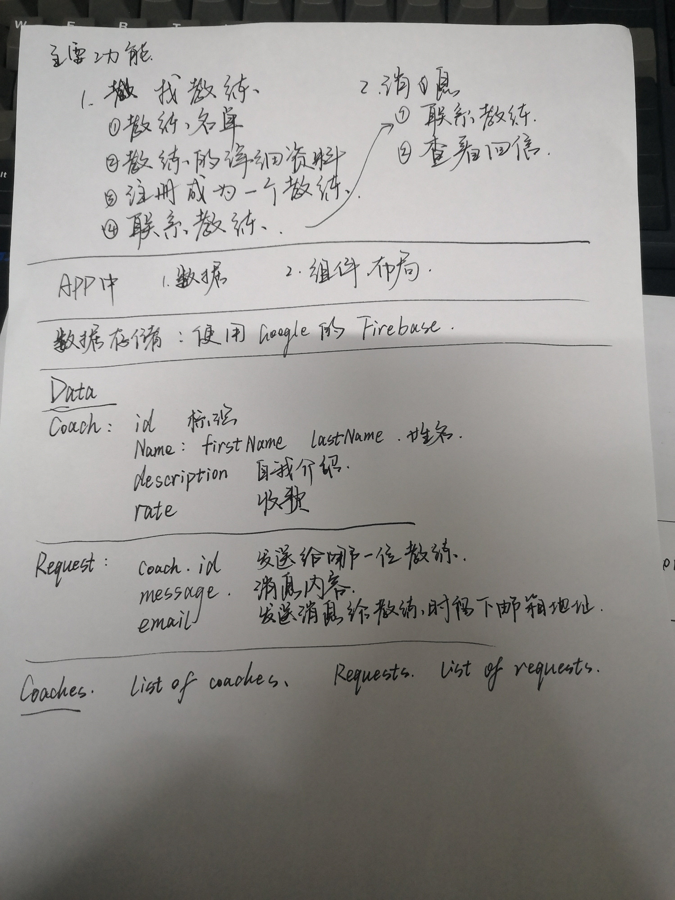

# main-project

## Project setup
```
npm install
```

### Compiles and hot-reloads for development
```
npm run serve
```

### Compiles and minifies for production
```
npm run build
```

### Lints and fixes files
```
npm run lint
```

### Customize configuration
See [Configuration Reference](https://cli.vuejs.org/config/).

# 设计初稿



# 主要功能

## 寻找教师

### 1. 显示教师名单

### 2. 查看教师详细资料

### 3. 注册成为一位教师

### 4. 联系教师

## 交流板块

### 1. 联系教师

### 2. 查看消息

# 数据

## 数据存储

使用 Google 的 Firebase 存储数据。

## coaches

包含所有 coach 的数组

## Coach

|    Name     |  Type  |    Description     |
| :---------: | :----: | :----------------: |
|     id      |        |  教师的唯一标识符  |
| first_name  | string |      教师的名      |
|  last_name  | string |      教师的姓      |
| description | string |    教师自我介绍    |
|    rate     | number | 教师收费（每小时） |
|    class    | array  |    教师分类标签    |

### class可能选项

|   Name   |
| :------: |
| frontend |
| backend  |
|  career  |


## requests

包含所有 request 的数组

## Request

|   Name   |  Type  |     Description      |
| :------: | :----: | :------------------: |
| coach_id |        | 接受消息的教师标识符 |
| message  | string |       消息内容       |
|  email   | string |  留给教师的邮箱地址  |

