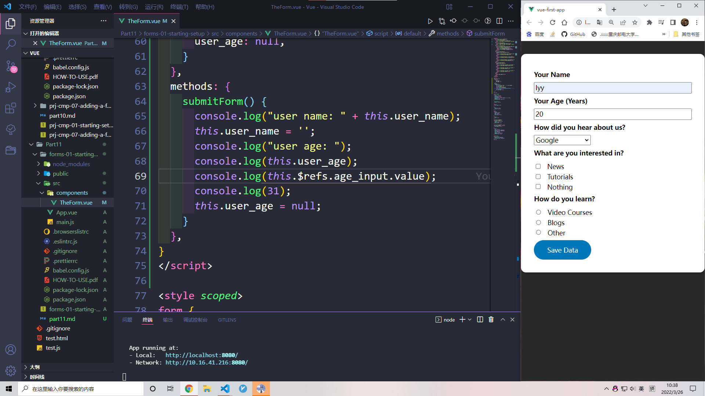

从input标签中获取数据有两种方式

1. 使用v-model双向绑定
2. @input

# 为什么不使用ref



控制台打印：


可以看到，$refs获取到的不是Number


获取到的是String，原生js中dom操作也是获取的string


# v-model修饰符

可以使用修饰符让vue强制转换类型

```
v-model.number="..."
```

```
v-model.trim="..."
// 过滤首尾空白字符
v-model.lazy="..."
// 在change事件后同步
```


# form的select

v-model同样适用于select


# 复选框checkboxes

给每一个复选框加上v-model


会出现选一个就把所有的都选了


将interest改为数组，可以解决这个问题u，但同时出现新的问题，当全选后想要取消任意一个，会导致取消全部。

我们需要给每个复选框添加value，让vue知道谁是谁。


## 只有一个选项的复选框


只用加一个v-model，并且设置初始值为false


当被选定后，confirm会自动变为true


# 单选框radio

也需要给每一个单选框加上v-model


每一个加上value


## 总结

单选框复选框都需要在每一个选项加上v-model和value

# blur

当一个元素失去焦点的时候 blur 事件被触发。不会冒泡


# 自定义组件使用v-model

下面两种写法是等价的（后面加上@update:modelValue="")


组件内


最后可以替换调本地的数据，直接使用modelValue

