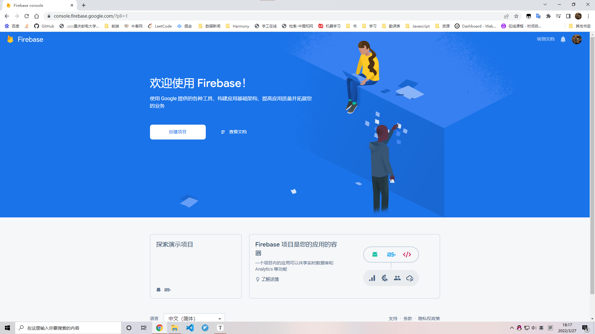
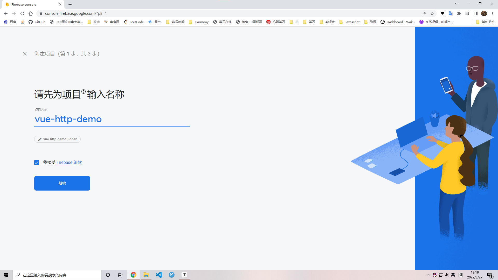
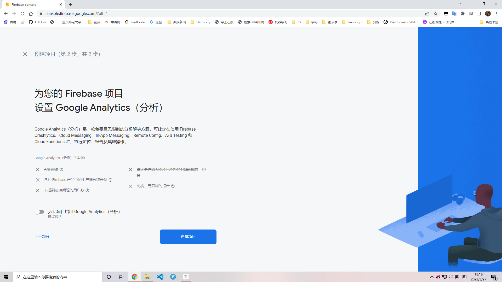
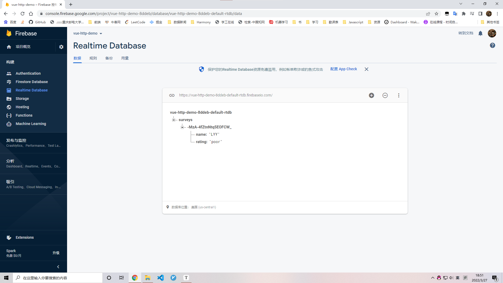
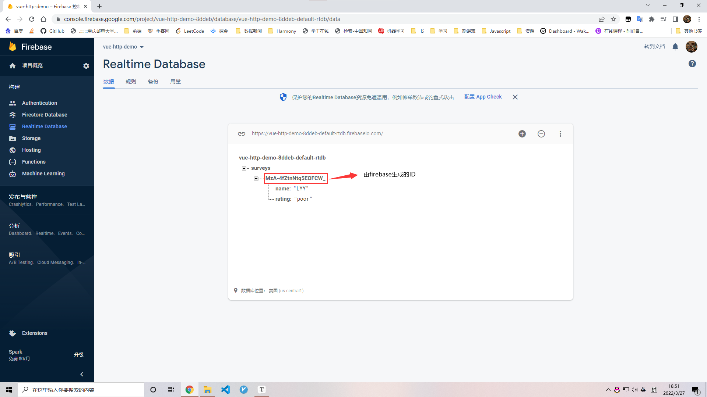
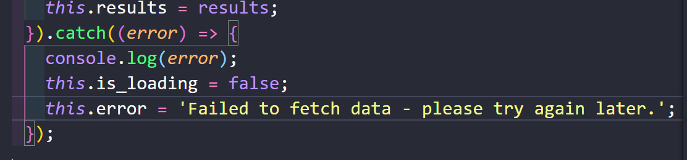
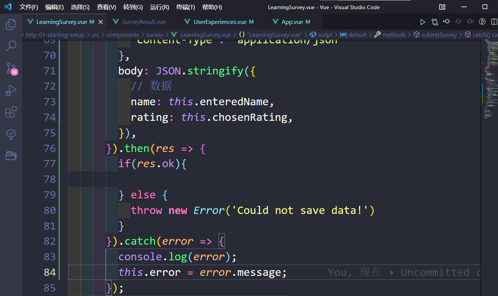

# firebase

后端，firebase

https://firebase.google.com/

转到控制台







## 创建realtime database

,
      });
```





## 发送GET请求至firebase

```
fetch('https://vue-http-demo-8ddeb-default-rtdb.firebaseio.com/surveys.json', {
        // method: 'GET', 默认的可以不用设置
        // 没有body就不需要header来告诉服务器是什么类型的数据
        // 没有body是因为GET请求不携带数据
      });
```

```
fetch('https://vue-http-demo-8ddeb-default-rtdb.firebaseio.com/surveys.json').then((res) => {
          if(res.ok) {
            // 自带的ok
            return res.json(); // 解析JSON格式的数据
          }
        }
      ).then((data) => {
        console.log(data);
      });
```

## 处理请求错误

在fetch的所有then后添加



## 处理响应错误

