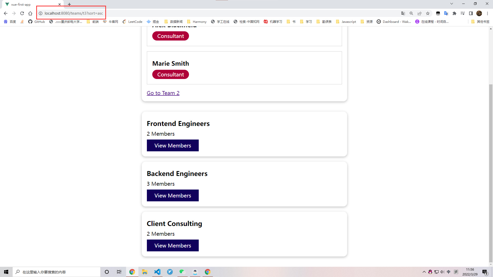

# Roating

安装

```bash
npm install --save vue-router
```

# 添加路由

导入包

```js
import { createRouter } from 'vue-router';
```

## history

告诉vue如果管理路由历史

```js
import { createRouter, createWebHistory } from 'vue-router';
```

createWebHistory：告诉 vue 使用内置浏览器支持

## routes

所有支持的不同的路线

```js
const router = createRouter({
    history: createWebHistory(),
    routes: []
});
```

# 注册路由

每一个对象代表一条路由，path ： Url

---

main.js

```js
const router = createRouter({
  history: createWebHistory(),
  routes: [
    { path: '/teams', component: TeamsList }, // our-domain.com/teams => TeamsList
    { path: '/users', component: UsersList }, // our-domain.com/users => UsersList
  ],
});
const app = createApp(App);
app.use(router);
```

这之后就可以使用 route-view 组件了

---

app.js

```html
<!-- <component :is="activePage"></component> -->
<router-view></router-view>
```

```js
// import TeamsList from './components/teams/TeamsList.vue';
// import UsersList from './components/users/UsersList.vue';
import TheNavigation from './components/nav/TheNavigation.vue';

export default {
  components: {
    TheNavigation,
    // TeamsList,
    // UsersList,
  },
 }
```

---


router-link 本质上是一个a标签，所以写样式的时候

```css
a {
  text-decoration: none;
  background: transparent;
  border: 1px solid transparent;
  cursor: pointer;
  color: white;
  padding: 0.5rem 1.5rem;
  display: inline-block;
}

a:hover,
a:active,
a.router-link-active {
  color: #f1a80a;
  border-color: #f1a80a;
  background-color: #1a037e;
}
```

`a.router-link-active`告诉vue当前链接激活时，应用于渲染的 `<a>` 的css，还可以使用 linkActiveClass

还可以使用更精准的exact


---

main.js

```js
const router = createRouter({
  history: createWebHistory(),
  routes: [
    { path: '/teams', component: TeamsList }, 
    { path: '/users', component: UsersList },
  ],
  linkActiveClass: 'active',
});
```

---

TheNavigation.vue

```css
a:hover,
a:active,
a.active {
  color: #f1a80a;
  border-color: #f1a80a;
  background-color: #1a037e;
}
```


---

# 以编程模式导航

---

TheNavigation.vue

```html
<button @click="confirmInput">Confirm</button>
```

```js
confirmInput() {
  // do something
  this.$router.push('/teams'); // 将新路由添加进历史记录里,并去到它
}
```

---

$router 中的其他方法

## back()

## forward()

就像浏览器的前进后退键


# 动态路由


# $route

```js
this.$route.path
```

会得到路径：/teams/t1

但可以使用下面的方法更轻松获取

```js
const teamId = this.$route.params.teamId;
```

如果你已经在一个动态路由的页面，想去另一个动态路由的页面，如从 teams/t1 -> teams/t2

url 会改变，但是界面没有转换。

这是因为vue不会破坏并重建已经加载完的组件（我们挂载到created上的）

可以使用watch来解决


```js
{ path: '/teams/:teamId', component: TeamMembers, props: true},
```

`props: true`告诉Vue要把teamId传到这个组件中

---

处理 '/'的两种方法

```js
{ path: '/', redirect: '/teams' },
```


```js
{ path: '/teams', component: TeamsList, alias: '/' },
```

第一个是重定向，url会改变，第二个是别名，url不会改变

# 捕获所有

```js
{ path: '/:notFound(.*)', redirect: '/teams' },
```

()里的是正则表达式

# 嵌套路由

在路由中设置children

```js
	{
      path: '/teams',
      component: TeamsList,
      children: [
        { path: ':teamId', component: TeamMembers, props: true },
      ],
    },
```

---

TeamItem.vue

```js
team_members_link() {
  // return '/teams/' + this.id;
  return { name: 'team-member', params: { teamId: this.id}};
}
```

---

main.js

```js
const router = createRouter({
  history: createWebHistory(),
  routes: [
    { path: '/', redirect: '/teams' },
    {
      name: 'teams',
      path: '/teams',
      component: TeamsList,
      children: [
        { name: 'team-member', path: ':teamId', component: TeamMembers, props: true },
      ],
    }, // our-domain.com/teams => ...
    { path: '/users', component: UsersList },
    { path: '/:notFound(.*)', component: NotFound },
  ],
  linkActiveClass: 'active',
});
```

# query params

```js
export default {
  props: ['id', 'name', 'memberCount'],
  computed: {
    team_members_link() {
      // return '/teams/' + this.id;
      return { name: 'team-member', params: { teamId: this.id}, query: { sort: 'asc' }};
    }
  }
};
```



```js
this.$route.query
```

# 同一级别的多个路由视图

---

APP.vue

```html
<template>
  <the-navigation></the-navigation> <!-- @set-page="setActivePage" -->
  <main>
    <!-- <component :is="activePage"></component> -->
    <router-view></router-view>
  </main>
  <footer>
    <router-view name="footer"></router-view>
  </footer>
</template>
```


---

main.js

```js
import TeamFooter from './components/teams/TeamFooter.vue';
import UserFooter from './components/users/UserFooter.vue';

const router = createRouter({
  history: createWebHistory(),
  routes: [
    { path: '/', redirect: '/teams' },
    {
      name: 'teams',
      path: '/teams',
      // ! 修改为components
      // component: TeamsList,
      components: { default: TeamsList, footer: TeamFooter },
      children: [
        {
          name: 'team-member',
          path: ':teamId',
          component: TeamMembers,
          props: true,
        },
      ],
    }, // our-domain.com/teams => ...
    { path: '/users', components: { default: UsersList, footer: UserFooter }, },
    { path: '/:notFound(.*)', component: NotFound },
  ],
  linkActiveClass: 'active',
});
```

# 控制滚动

---

main.js

```js
  scrollBehavior(to, from, savedPosition) {
    console.log(to, from, savedPosition);
    if (savedPosition) {
      return savedPosition;
    }
    return {
      left: 0,
      top: 0,
    };
  },
```

# 导航守卫

## 全局守卫

```js
router.beforeEach(function (to, from, next) {
  console.log("Global beforeEach");
  console.log(to, from);
  next();
});
```

在每一次导航操作之前，都会调用这个函数

### next()没有参数

通过

### next(false)

不通过

### next('str')或next(object)

next('/users')导航到某个地方

```js
next('/user');
next({
     name: 'team-member',
     params: { teamId: 't2' }
});
```

## 单个守卫

beforeEnter

```js
{
      path: '/users',
      components: { default: UsersList, footer: UserFooter },
      beforeEnter(to, from, next) {
        console.log("User before enter");
        console.log(to, from);
        next();
      },
    },
```

除了在main中添加，还可以在组件中添加

---

UserList.vue

```js
export default {
  components: {
    UserItem,
  },
  inject: ['users'],
  methods: {
    confirmInput() {
      // do something
      this.$router.push('/teams'); // 将新路由添加进历史记录里,并去到它
    }
  },
  beforeRouteEnter (to, from, next) {
    // 在渲染该组件的对应路由被验证前调用
    // 不能获取组件实例 `this` ！
    // 因为当守卫执行时，组件实例还没被创建！
  }
};
```

## 守卫顺序

全局  >  单个  >  组件内

beforeRouteLeave
