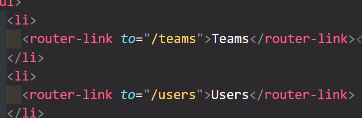
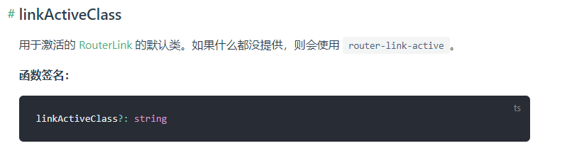
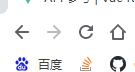
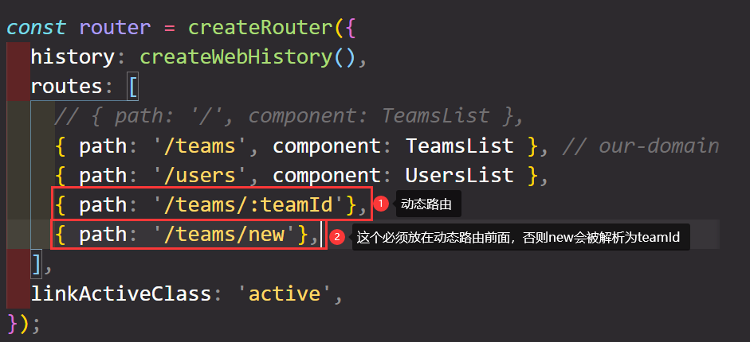

# Roating

安装

```bash
npm install --save vue-router
```

# 添加路由

导入包

```js
import { createRouter } from 'vue-router';
```

## history

告诉vue如果管理路由历史

```js
import { createRouter, createWebHistory } from 'vue-router';
```

createWebHistory：告诉 vue 使用内置浏览器支持

## routes

所有支持的不同的路线

```js
const router = createRouter({
    history: createWebHistory(),
    routes: []
});
```

# 注册路由

每一个对象代表一条路由，path ： Url

---

main.js

```js
const router = createRouter({
  history: createWebHistory(),
  routes: [
    { path: '/teams', component: TeamsList }, // our-domain.com/teams => TeamsList
    { path: '/users', component: UsersList }, // our-domain.com/users => UsersList
  ],
});
const app = createApp(App);
app.use(router);
```

这之后就可以使用 route-view 组件了

---

app.js

```html
<!-- <component :is="activePage"></component> -->
<router-view></router-view>
```

```js
// import TeamsList from './components/teams/TeamsList.vue';
// import UsersList from './components/users/UsersList.vue';
import TheNavigation from './components/nav/TheNavigation.vue';

export default {
  components: {
    TheNavigation,
    // TeamsList,
    // UsersList,
  },
 }
```

---



router-link 本质上是一个a标签，所以写样式的时候

```css
a {
  text-decoration: none;
  background: transparent;
  border: 1px solid transparent;
  cursor: pointer;
  color: white;
  padding: 0.5rem 1.5rem;
  display: inline-block;
}

a:hover,
a:active,
a.router-link-active {
  color: #f1a80a;
  border-color: #f1a80a;
  background-color: #1a037e;
}
```

`a.router-link-active`告诉vue当前链接激活时，应用于渲染的 `<a>` 的css，还可以使用 linkActiveClass

还可以使用更精准的exact



---

main.js

```js
const router = createRouter({
  history: createWebHistory(),
  routes: [
    { path: '/teams', component: TeamsList }, 
    { path: '/users', component: UsersList },
  ],
  linkActiveClass: 'active',
});
```

---

TheNavigation.vue

```css
a:hover,
a:active,
a.active {
  color: #f1a80a;
  border-color: #f1a80a;
  background-color: #1a037e;
}
```

---

# 以编程模式导航

---

TheNavigation.vue

```html
<button @click="confirmInput">Confirm</button>
```

```js
confirmInput() {
  // do something
  this.$router.push('/teams'); // 将新路由添加进历史记录里,并去到它
}
```

---

$router 中的其他方法

## back()

## forward()

就像浏览器的前进后退键



# 动态路由



# $route

```js
this.$route.path
```

会得到路径：/teams/t1

但可以使用下面的方法更轻松获取

```js
const teamId = this.$route.params.teamId;
```

如果你已经在一个动态路由的页面，想去另一个动态路由的页面，如从 teams/t1 -> teams/t2

url 会改变，但是界面没有转换。

这是因为vue不会破坏并重建已经加载完的组件（我们挂载到created上的）

可以使用watch来解决


