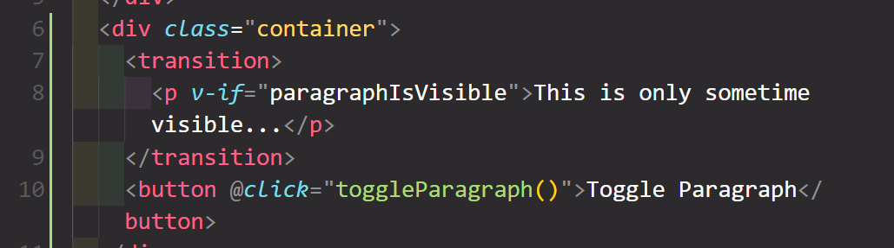
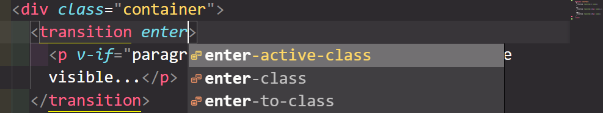
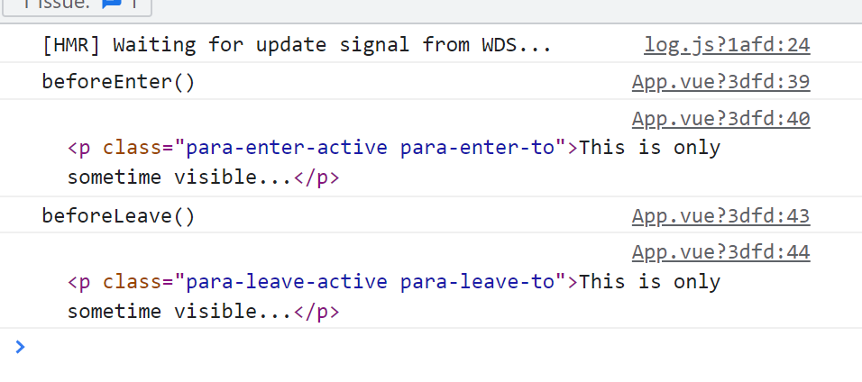
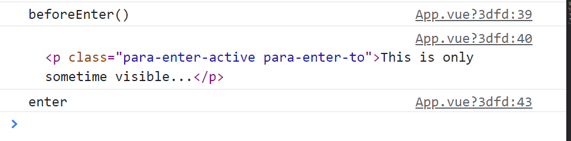
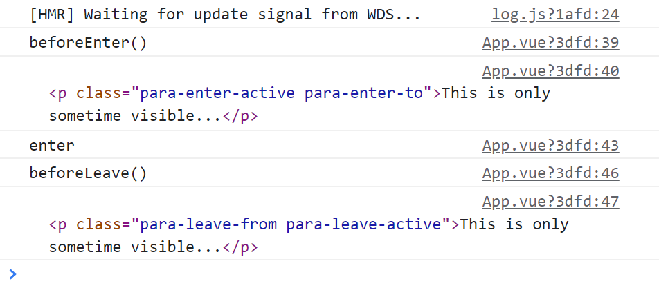
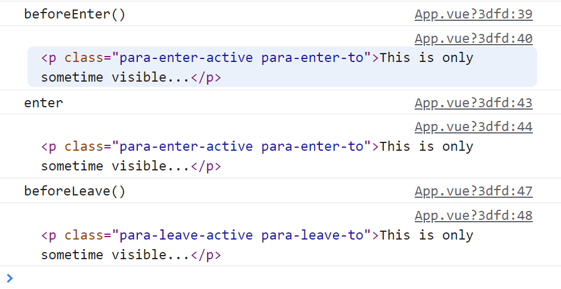

有的动画需要在删除某个节点之前，这时候因为涉及到删除dom所以不能单纯使用css完成，这时候就需要vue

# transition



# 单个元素的情况

#### enter-from

一开始添加，然后没有

#### enter-active

一开始添加

#### enter-to

动画结束时添加

#### leave-from

#### leave-active

#### leave-to

```css
.v-enter-from {
  opacity: 0;
  transform: translateY(-30px);
}

.v-enter-active {
  transition: all 0.3s ease-out;
}

.v-enter-to {
  opacity: 1;
  transform: translateY(0);
}

.v-leave-from {
  opacity: 1;
  transform: translateY(0);
}

.v-leave-active {
  transition: all 0.3s ease-in;
}

.v-leave-to {
  opacity: 0;
  transform: translateY(-30px);
}
```

```css
.v-enter-active {
  animation: slide-fade 0.3s ease-out;
}

.v-leave-active {
  animation: slide-fade 0.3s ease-out;
}

@keyframes slide-fade {
  0% {
    transform: translateX(0) scale(1);
  }

  70% {
    transform: translateX(-120px) scale(1.1);
  }

  100% {
    transform: translateX(-150px) scale(1);
  }
}
```

这里v-leave-active和v-enter-active添加forwards都无效：因为在动画结束后这俩就会各自被删去，它们自己不知道结束了（因为已经被删了）

```html
<transition name="para">
   <p v-if="paragraphIsVisible">This is only sometime visible...</p>
</transition>
```

```css
.para-enter-active {
  animation: slide-fade 0.3s ease-out;
}

.para-leave-active {
  animation: slide-fade 0.3s ease-out;
}
```

名字完全自定义：



确保translation标签中只有一个直接子女因此在使用自定义模板时，需要格外小心

```html
<template>
  <div v-if="open" class="backdrop" @click="$emit('close')"></div>
  <transition name="modal">
    <dialog open v-if="open">
      <slot></slot>
    </dialog>
  </transition>
</template>
```

# 多个元素的情况

只能用v-if v-else-if v-else， 不能用多个v-if，vue它不懂

```html
<transition name="fade-button">
    <button @click="showUsers" v-if="!usersAreVisible">Show Users</button>
    <button @click="hideUsers" v-else>Hide Users</button>
</transition>
```

# transition的mode

`mode` - `string` 控制离开/进入过渡的时间序列。有效的模式有 `"out-in"` 和 `"in-out"`；默认同时进行。

- `in-out`: 新元素先进行进入过渡，完成之后当前元素过渡离开。
- `out-in`: 当前元素先进行离开过渡，完成之后新元素过渡进入。

## before-enter

在 *-enter-from时运行

## before-leave

在 *-leave-from时运行

## enter

在enter-active时运行

```js
methods: {
    beforeEnter() {
      console.log('beforeEnter()');
    },
    beforeLeave() {
      console.log('beforeLeave()');
    },
  },
```

```html
<transition name="para" @before-enter="beforeEnter" @before-leave="beforeLeave">
    <p v-if="paragraphIsVisible">This is only sometime visible...</p>
</transition>
```

---

```js
methods: {
    beforeEnter(el) {
      console.log('beforeEnter()');
      console.log(el);
    },
    beforeLeave(el) {
      console.log('beforeLeave()');
      console.log(el);
    },
  },
```



---

```html
<transition name="para" @before-enter="beforeEnter" @enter="enter" @before-leave="beforeLeave">
   <p v-if="paragraphIsVisible">This is only sometime visible...</p>
</transition>
```

```js
beforeEnter(el) {
   console.log('beforeEnter()');
   console.log(el);
},
enter(el) {
      console.log('enter');
      console.log(el)
},
beforeLeave(el) {
   console.log('beforeLeave()');
   console.log(el);
},
```

enter







## after-enter

在动画结束之后，比如 0.3s之后

## leave after-leave

# enter-cancelled

# leave-cancelled

在连续点击的时候用上他们，这样就不会出现闪烁的情况

```js
methods: {
    enterCancelled() {
      clearInterval(this.enterInterval);
    },
    leaveCancelled() {
      clearInterval(this.leaveCancelled)
    },
    enter(el, done) {
      console.log('enter');
      console.log(el);
      let round = 1;
      this.enterInterval = setInterval(() => {
        el.style.opacity = round * 0.01;
        round++;
        if (round > 100) {
          clearInterval(this.enterInterval);
          done();
        }
      }, 20);
    },
    leave(el, done) {
      console.log('leave');
      let round = 1;
      this.leaveInterval = setInterval(() => {
        el.style.opacity = 1 - round * 0.01;
        round++;
        if (round > 100) {
          clearInterval(this.leaveInterval);
          done();
        }
      }, 20);
    },
  },
```

# :css="false"

告诉vue这个组件不会用到css，全部由js控制动画，这样就不会去搜索css，让一切变得更快

# animated-list

## transition-group

不同于transition，它会被添加到dom中，成为其中的一个元素，使用`tag='ul'`就变成了ul标签

### *-move

用于处理其他元素
