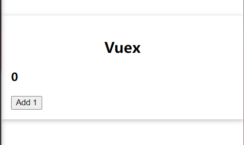
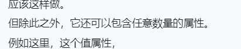

# Vuex

管理全局状态的库

```bash
npm install --save vuex
```


## Local  State

## Global State

# store

一个app只有一个store

---

main.js

```js
import { createStore } from 'vuex';

const store = createStore({
  state() {
    return {
      counter: 0,
    };
  },
});

app.use(store);
```

---

App.vue

```vue
<template>
  <base-container title="Vuex">
    <h3>{{ counter }}</h3>
    <button @click="addOne">Add 1</button>
  </base-container>
</template>

<script>
import BaseContainer from './components/BaseContainer.vue';

export default {
  components: {
    BaseContainer,
  },
  computed: {
    counter() {
      return this.$store.state.counter;
    },
  },
  methods: {
    addOne() {
      this.$store.state.counter++;
    },
  },
};
</script>

<style>
* {
  box-sizing: border-box;
}

html {
  font-family: sans-serif;
}

body {
  margin: 0;
}
</style>

```



组件之间传递数据用这个极其方便

# mutations

---

main.js

```js
const store = createStore({
  state() {
    return {
      counter: 0,
    };
  },
  mutations: {
    increment(state) {
      state.counter += 2;
    },
  },
});
```

---

```vue
<template>
  <button @click="addOne">Add one</button>
</template>

<script>
export default {
  methods: {
    addOne() {
      this.$store.commit('increment');
    },
  },
};
</script>
```

## 有参数

下面两种方式都可以

第二种方式：



```vue
addOne() {
      // this.$store.commit('increase', { value: 1 });
      this.$store.commit({
        type: 'increase',
        value: 1,
      });
    },
```

---

main.js

```js
mutations: {
  increase(state, payload) {
    state.counter += payload.value;
  },
},
```

# Getters

获得数据，有点像computed

也可以接受两个参数，一个是state，一个是getters

可以多个getter互相依赖

---

main.js

```js
const store = createStore({
  state() {
    return {
      counter: 0,
    };
  },
  mutations: {
    increase(state, payload) {
      state.counter += payload.value;
    },
  },
  getters: {
    finalCounter(state) {
      return state.counter * 2;
    },
  },
});
```

组件

```js
export default {
  computed: {
    counter() {
      return this.$store.getters.finalCounter;
    },
  },
};
```

