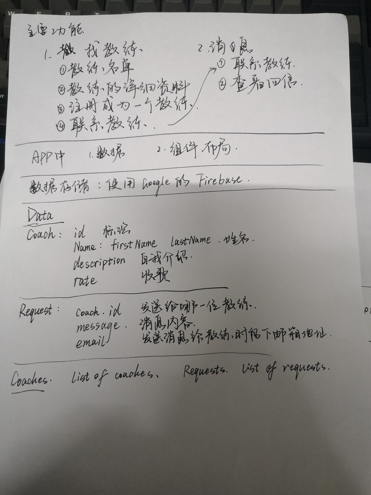
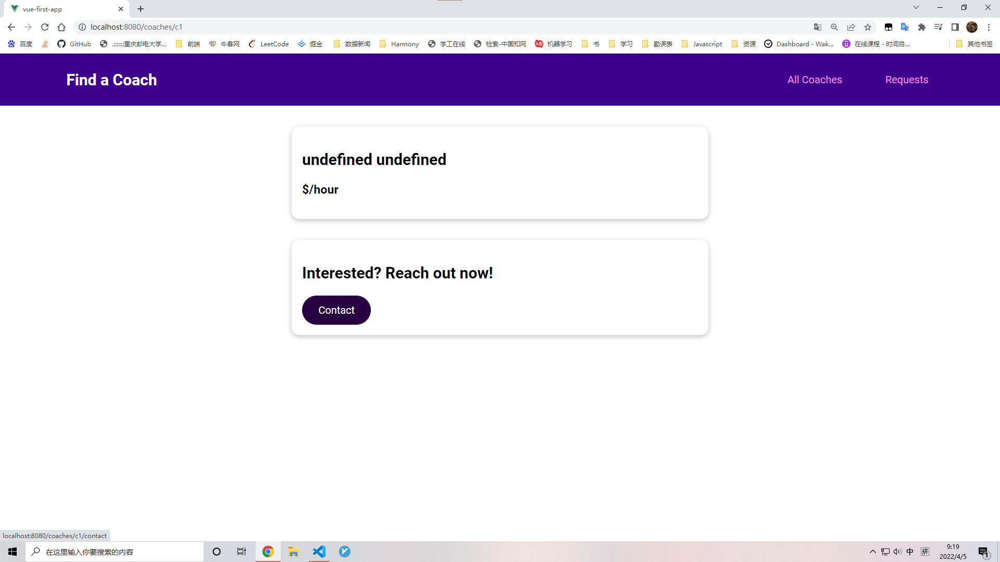
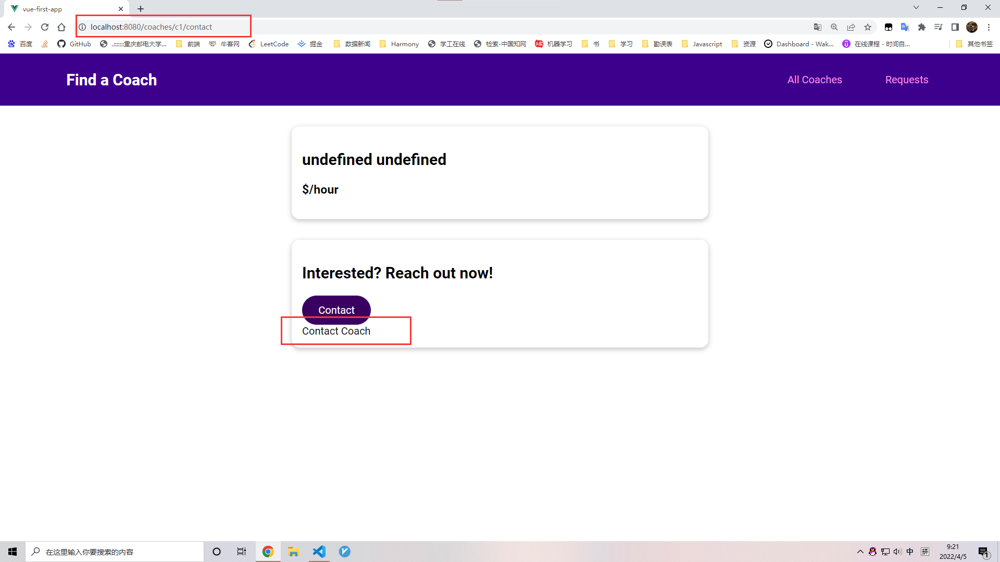
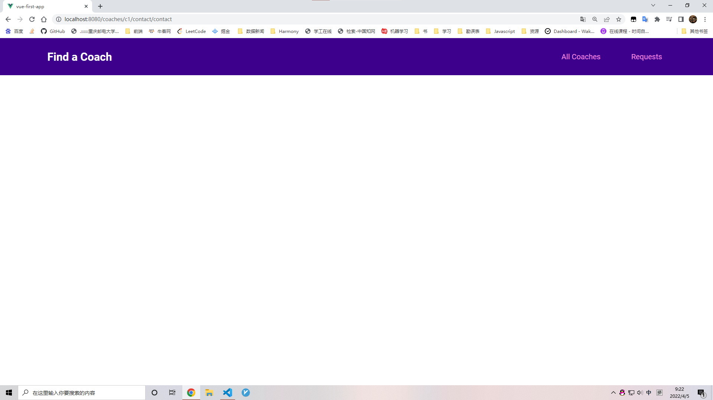
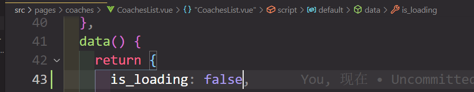
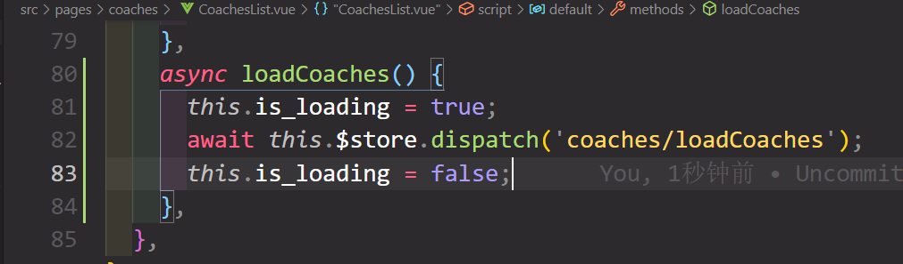
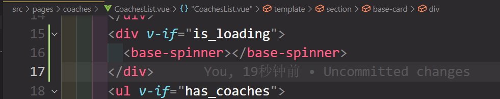
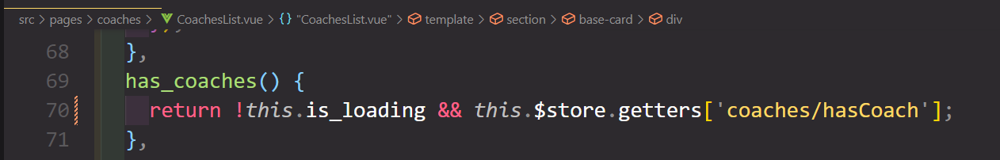

# main-project

## Project setup
```
npm install
```

### Compiles and hot-reloads for development
```
npm run serve
```

### Compiles and minifies for production
```
npm run build
```

### Lints and fixes files
```
npm run lint
```

### Customize configuration
See [Configuration Reference](https://cli.vuejs.org/config/).

# 设计初稿



# 主要功能

## 寻找教师

### 1. 显示教师名单

### 2. 查看教师详细资料

### 3. 注册成为一位教师

### 4. 联系教师

## 交流板块

### 1. 联系教师

### 2. 查看消息

# 数据

## 数据存储

使用 Google 的 Firebase 存储数据。

## coaches

包含所有 coach 的数组

## Coach

|    Name     |  Type  |    Description     |
| :---------: | :----: | :----------------: |
|     id      |        |  教师的唯一标识符  |
| first_name  | string |      教师的名      |
|  last_name  | string |      教师的姓      |
| description | string |    教师自我介绍    |
| hourly_rate | number | 教师收费（每小时） |
|    areas    | array  |    教师分类标签    |

### areas可能选项

|   Name   |
| :------: |
| frontend |
| backend  |
|  career  |


## requests

包含所有 request 的数组

## Request

|   Name   |  Type  |     Description      |
| :------: | :----: | :------------------: |
| coach_id |        | 接受消息的教师标识符 |
| message  | string |       消息内容       |
|  email   | string |  留给教师的邮箱地址  |

# 步骤

1. 设置路由
1. App.vue
1. 导航和基本组件
1. 所有组件使用一些虚拟数据结合导航展示出来
1. 开始添加数据
1. 某一功能数据添加后开始分离出小组件

# 遇到的问题

1. 教师的分类标签用怎样的方式展现？考虑标签数量特别多的情况

​	方案一：

​	适用于数量少的情况，预设所有标签，使用v-if展示标签（介于标签的切换不会很频繁，因此不使用v-show）

​	方案二：

​	使用数组结合ul展示标签（难点在于处理每个标签的样式）

​	方案三：

​	使用组件，class 与 type 绑定，type 即为标签名

​	最终：

​	采用方案三

```vue
<template>
  <span class="badge" :class="type">
    {{ text }}
  </span>
</template>
```

```vue
<base-badge
        v-for="area in areas"
        :key="area"
        :title="area"
        :type="area"
></base-badge>
```

2. firebase 中的数据和本地数据

​	使用 refresh 按钮同步，且项目初期先使用本地的虚拟数据

3. 路由中制作notfound页面

​	使用动态路由配合正则表达式实现

```js
// 其他页面
{ path: '/:notfound(.*)', component: null },
```

​	复习正则表达式

| 符号 |                             用法                             |
| :--: | :----------------------------------------------------------: |
|  .   | 匹配除“\r\n”之外的任何单个字符。要匹配包括“\r\n”在内的任何字符，请使用像“[\s\S]”的模式。 |
|  *   |                  匹配前面的子表达式人任意次                  |
|  \r  |             匹配一个回车符。等价于 \x0d 和 \cM。             |
|  \n  |             匹配一个换行符。等价于 \x0a 和 \cJ。             |
|  \s  | 匹配任何空白字符，包括空格、制表符、换页符等等。等价于 [ \f\n\r\t\v]。 |
|  \f  |             匹配一个换页符。等价于 \x0c 和 \cL。             |
|  \t  |             匹配一个制表符。等价于 \x09 和 \cI。             |
|  \v  |           匹配一个垂直制表符。等价于 \x0b 和 \cK。           |

4. APP从何开始

​	规划完之后，先确定每个页面有什么内容，如：

​	App.vue

```vue
<template>
  <section>Filter</section>
  <section>List of Coaches</section>
</template>
```

​	再考虑是否为此添加组件。

---

4. 先添加数据还是先设置布局

​	先设置导航和基本功能的布局，这样以便在编辑基本数据时可以随时观察。

5. 导航到嵌套路由

​	记得在父组件中添加<router-view></router-view>

6. 访问不到getters

​	有可能是忽略使用了`namespaced:true`的原因

```js
computed: {
    filtered_coaches() {
      return this.$store.getters['coaches/coaches'];
    },
},
```

---

7. 如何让一个ui组件同时改变`a`和`button`标签的样式

​	使用一个props来区分二者

```vue
<template>
  <button v-if="!link">
    <slot></slot>
  </button>
  <router-link v-else>
    <slot></slot>
  </router-link>
</template>

<script>
export default {
  props: {
    // 该组件被调用时是否是 a 标签，默认为 false
    link: {
      type: Boolean,
      required: false,
      default: false,
    },
  },
};
</script>
```

---

8. 如何控制不同按钮不同的样式

​	使用一个 props 来绑定 class

```vue
<template>
  <button v-if="!link" :class="mode">
    <slot></slot>
  </button>
  <router-link v-else :to="to" :class="mode">
    <slot></slot>
  </router-link>
</template>

<script>
export default {
  props: {
    // 按钮的样式
    mode: {
      type: String,
      required: false,
      default: null,
    },
};
</script>
```

---

9. 在给 contact 添加route-link的to属性时，点击一次出现正确的页面，再点击一次跳转到notfound界面

​	主要原因在于使用了 `this.$route.path`



​	点击一次，出现正确画面



​	发现还可以再点击，点击后，链接多出一个/contact



​	解决方案，点击一次后就隐藏按钮，或者使用硬编码（采用）

```js
contact_link() {
  return '/coaches/' + this.id + '/contact';
},
```

10. 通过route加载的组件如何获得动态数据

​	在路由route.js中添加`props:true`

```js
{
  path: '/coaches/:id',
  component: CoachDetail,
  // 重点↓
  props:true,
  children: [{ path: 'contact', component: ContactCoach }],
},
```

即可在组件CoachDetail中使用动态 id

```js
export default {
  props: ['id'],
};
```

再根据id来获取coach的数据，需要用一个变量来存储（使用created钩子函数）【非常不熟悉】

11. 为什么要用created钩子函数而不用beforeCreat

​	因为beforeCreate的状态，组建的props/data/methods都处于**不可用**的状态，这时候用于存储数据的变量不可用，而created就能用了。

12. 为什么不用beforeMount和mount呢

​	这时候data里的数据已经生成为html了

13. 标签过滤器是否需要form标签包裹

​	不用

14. 如何在用户修正表单错误后及时将提醒样式去掉

​	input结合`blur`使用（失去焦点时触发）

```js
// 用户输入正确的数据之后取消样式
clearValidity(input) {
  this[input].is_valid = true;
},
```

​	复选框是每一个input都要添加

```html
<input
  type="checkbox"
  id="career"
  value="career"
  v-model="areas.val"
  @blur="clearValidity('areas')"
/>
```

---

15. 在给联系界面给教师发送消息时需要教练的`id`，如何获取到id？

​	方案一：由于该组件由路由控制，其父组件可以获取到`:id`的值（`props:true`，参考第10条），所以它也可获取到

```js
{
  path: '/coaches/:id',
  component: CoachDetail,
  props: true,
  //												↓在需要使用id的路由中设置 props:
  children: [{ path: 'contact', component: ContactCoach, props: true }],
},
```

​	方案二：使用`this.$route.params.id`

16. 加载页面时如何配置一个加载界面

​	主要思路：需要一个ui组件，其次http请求为异步操作，返回一个promise，可以监听它

​	具体实现步骤：

​	设置一个flag变量`is_loading: false`



​	在加载教练的函数中监听



​	其他需要修改的地方





# 经验

1. 记得在每一个数据模块中添加`namespaced: true`以分割数据
2. 记得考虑没有数据的情况

​	getters.js

```js
// 返回是否有数据
hasCoach(state) {
return state.coaches && state.coaches.length > 0;
},
```

---

3. 先确定该组件需要哪些父组件的数据（写好props），再到父组件中传递
4. 在使用computed写链接时，可以使用`this.$route.path`取代硬编码，更灵活

​	某组件内

```js
export default {
    coach_contact_link() {
      // return '/coaches/' + this.id + '/contact';
      return this.$route.path + '/' + this.id + '/contact';
    },
};
```

---

5. prop命名，参考vue官方文档

> **在声明 prop 的时候，其命名应该始终使用 camelCase，而在模板和 [JSX](https://v3.cn.vuejs.org/guide/render-function.html#jsx) 中应该始终使用 kebab-case。**

6. 在某个组件还没有完成之前，也不要将ui组件添加到它身上（更利于辨认哪些还未完成）
7. 在绑定 class 属性时，如果不想要添加额外的 class，可以将变量设置为 `null`，表示没有 class
7. 复选框一定要给每一个选项加上value值用以区分。
7. 复选框默认被选中只需要加上`checked`

```html
<input
  id="career"
  name="selected_coaches"
  type="checkbox"
  value="career"
  checked
/>;
```

---

10. 为避免频繁检测输入是否合法，可以使用`@blur`事件
11. 去掉输入的空白字符可以直接在`v-model`后面加上`.trim`
12. 使用`$refs`获得的value值总为字符串
13. 写表单里面的input和label时，先写出框架（也就是暂时只需要写出 id 、type、for即可）
14. 为了确保某一个空得到的数据为number类型，可以在`v-model`后面加上`.number`
14. 在注册为教师之后为了避免回到表单，我们可以使用`this.$router.replace()`而不用`push()`
14. 为了验证每一个输入是否正确，可以使用对象类型

```js
first_name: {
  val: '',
  is_valid: true,
},
```

---

17. 通过链接自动打开用户的邮件客户端，使用特殊的`mailto:`

```vue
<template>
  <li>
    <div>
      <a :href="email_link">{{ email }}</a>
    </div>
    <p>{{ message }}</p>
  </li>
</template>

<script>
export default {
  props: ['email', 'message'],
  computed: {
    email_link() {
      // 	 ↓重点	
      return 'mailto:' + this.email;
    },
  },
};
</script>
```

---

18. 注册的http请求采用PUT，因为POST总会创建一个新的数据
18. 本地数据配合 firebase 减少请求次数提升用户体验

