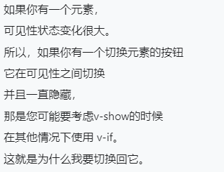
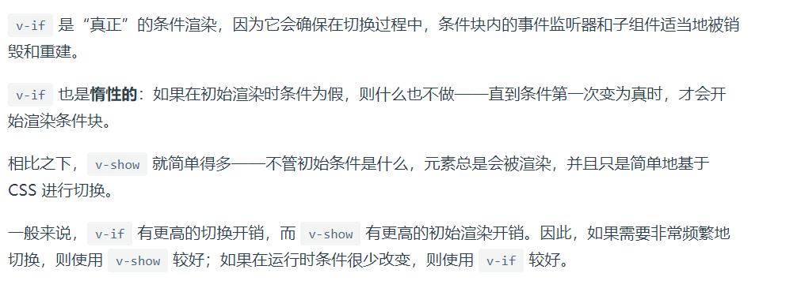
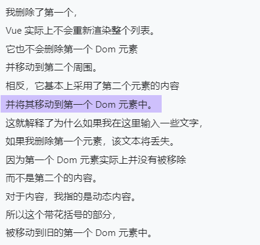

v-else 必须紧跟 v-if 后面（它俩中间不能有其他标签）

v-if、v-else-if、v-else 都会将false的元素清除

但 v-show 则将元素保留（只是用css的display将节点隐藏起来）

频繁地删除和增加元素会降低性能，但

切换很多就不要用 v-if

v-for 不会改变已有的（不会闪烁）很高效

也可以遍历对象、数字（num in 10）、数组

当你删除v-for中产生的一个子元素时，vue会将它的下一个元素替代至上一个

可以使用vue特有的html属性 `key`来解决

养成一个好习惯，用了v-for就用key

不要同时使用 v-for 和 v-if

