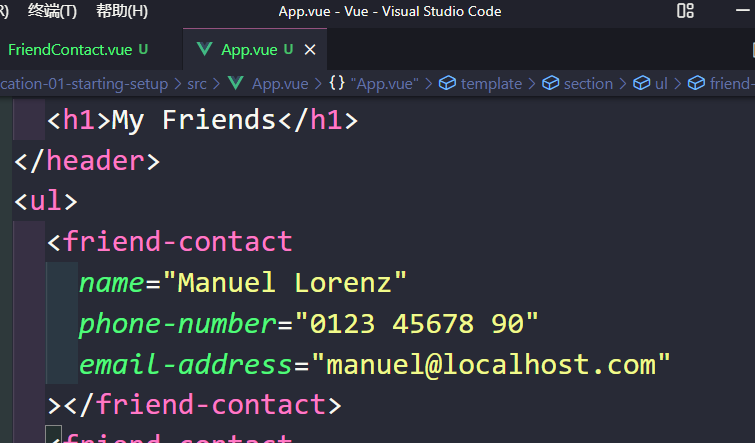
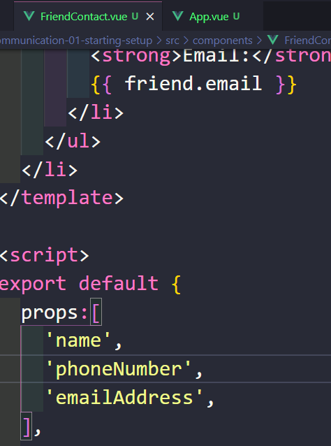
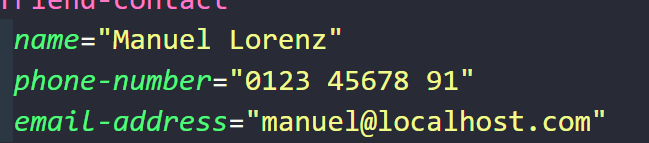
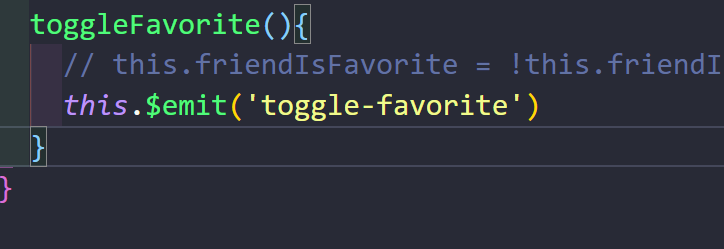
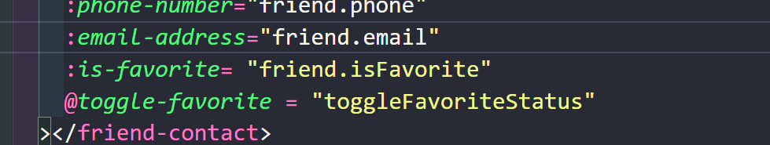
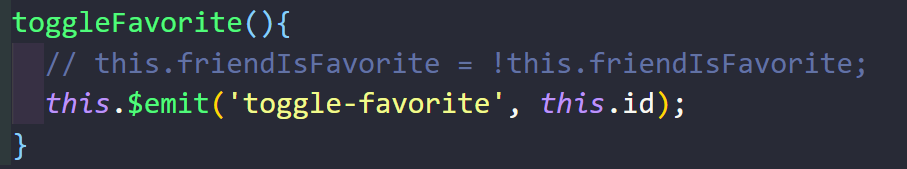
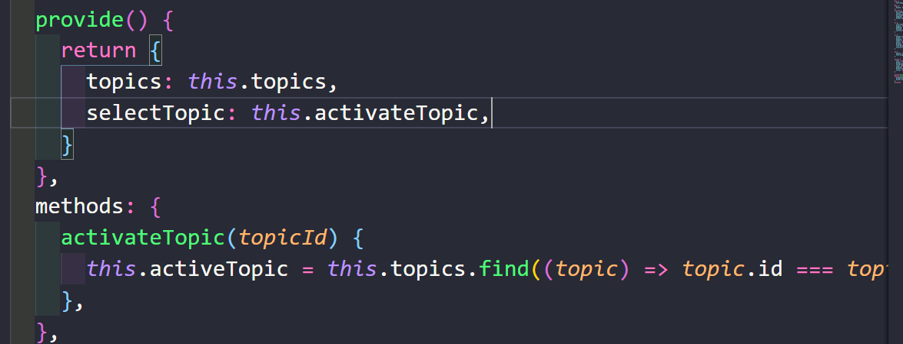

APP.vue中使用 kebab case，在组件中使用驼峰命名，vue会自动转换

parent 与 child 通过 props 交流数据

props 里的数据最好初始化之后不能再改变它 const （单向数据流），但有两种方法可以达到目的：

1. 让 parent 知道我们想要改变，parent 改变之后再传回来。
2. 新建一个容器（在 data 中），不改变原始的数据，但是我们可以改变容器里的数据，并最终将容器里的数据运用到页面上

下面这里只能设置为字符串，如果要设置为其他的，需要使用v-bind

法2：使用$emit()这个内置方法

emits 可以是数组或对象，从组件触发自定义事件，emits 可以是简单的数组，也可以是对象，后者允许配置事件验证。

使用 kabab case

除了第一个参数，后面可以有无数个参数代表数据（需要发送给parent的）

最好在props 下面加上 emits，方便其他程序员知道你哪些数据是可以发送至parent的而不用一个一个去找

provide 配合 inject 使用

只能 inject 自更高层 provide 的数据（数据必须在父组件或祖先组件provide），**之前的$emit是只能父组件？？？**

还可以传函数

