# 组件

如果组件全部注册至APP上（在main.js中），优点是只要在APP内部（全局），怎样嵌套在哪儿使用都可以，但问题是每次初始化浏览器都需要下载所有（组件）代码，严重影响性能。

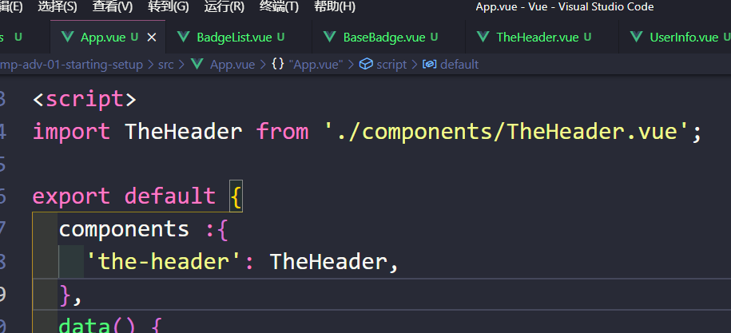

在模板中(template)也可以写作

<TheHeader />

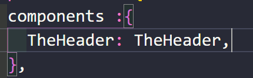

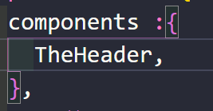

# style

不管你在何处添加的style，它都会作用于全局，使用 scoped，这样的话这个style只影响当前文件，子组件也不会影响

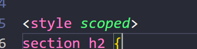

# 插槽slots 

v-slot可简写为#

当你想用自定义组件作为一个容器去包裹其他组件时，使用slot，只能使用一次插槽，除非给它们加上名字，不然vue不知道加到哪儿

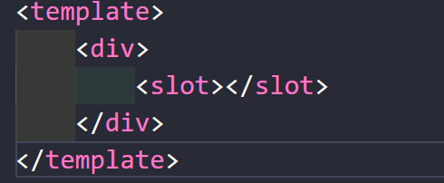

没加上名字：

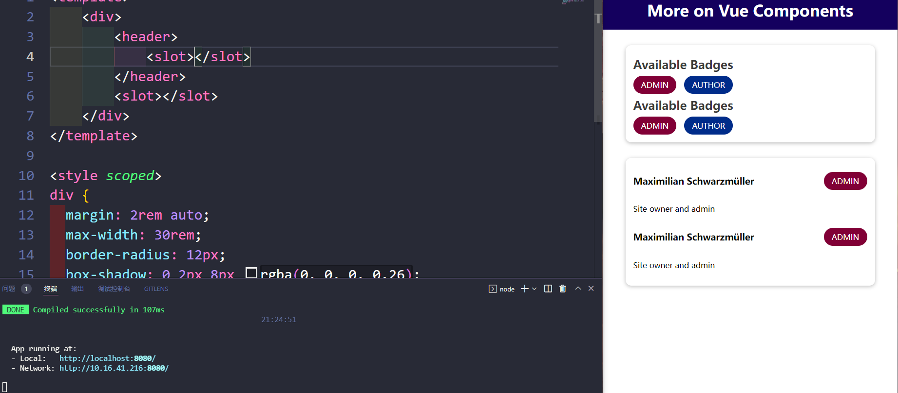

加上了名字：

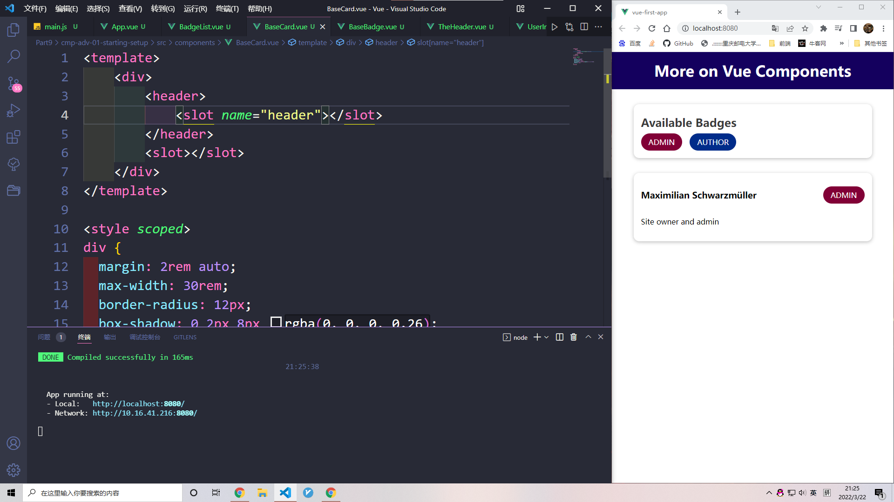

也就是不用给所有插槽加上名称，只需要区分出每一个插槽是什么（默认的没有名称的只能有一个）

# v-slot

让vue知道你这些内容需要插入到哪儿，default是保留词

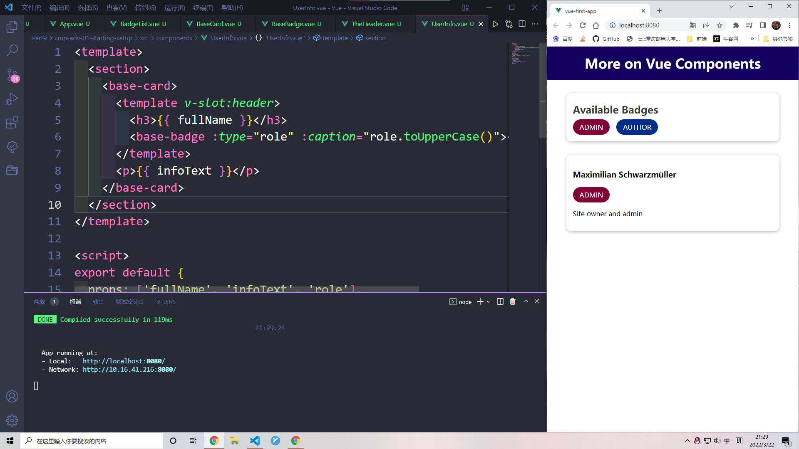

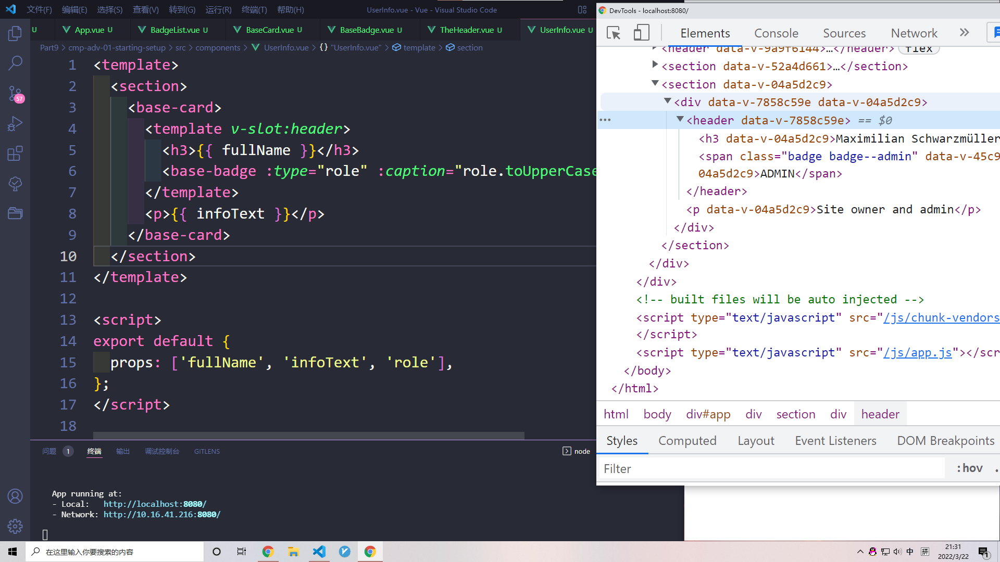

注意这里的template不会显示，最后显示的是组件上的header

如果有一个slot没有接受任何内容，那么它会重复接受默认的

this.$slots 包含了插槽的数据

# scoped slots 作用域插槽

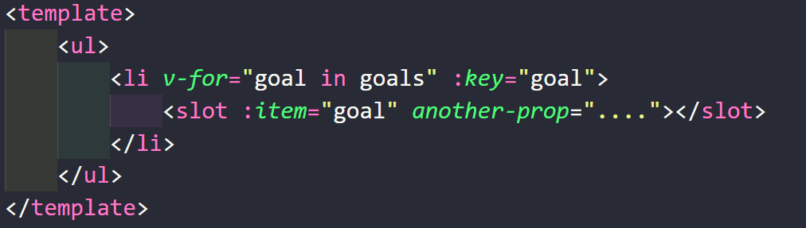

这是错误的↓

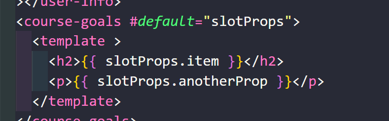

这是正确的↓

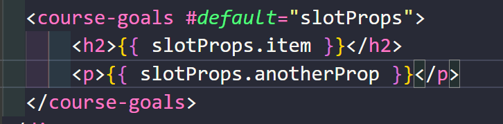

# 动态组件

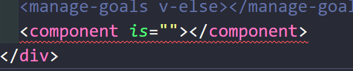

is 表示在这个component需要显示的组件

这个可以拿来做好东西了（比如nav）

在切换组件的时候，被切换掉的组件是被从DOM中删去，也就是说再次切换到这个组件时，它的状态已经不是第一次的状态了

解决办法，使用keep-alive

# keep-alive

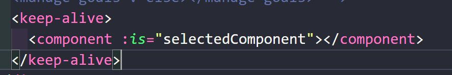

告诉vue组件不应该被完全删除，需要保存它们的状态

# teleport

需要 1个prop，1个attribute

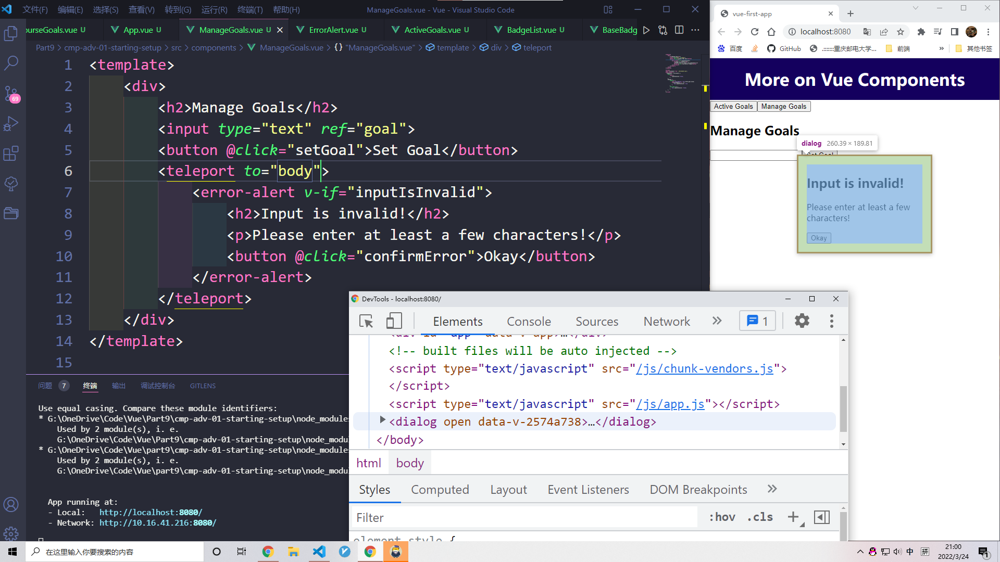